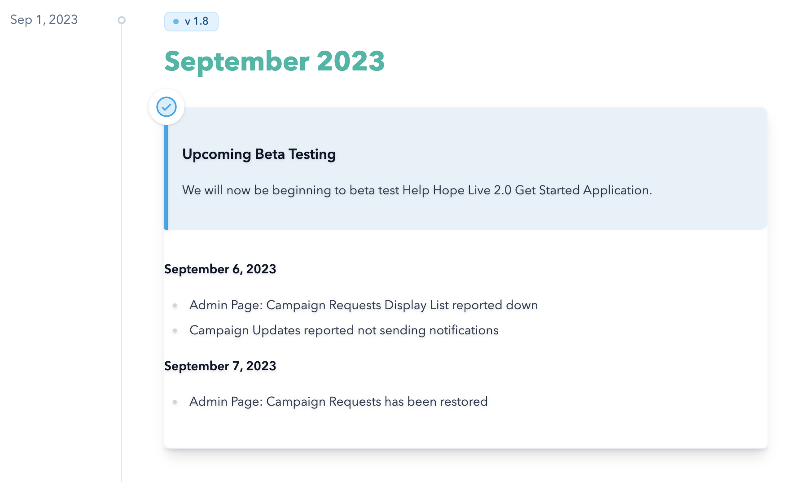

# Change Log Website

A web application built to track and display organizational changes, improving communication between the IT department and the rest of the company. This project was developed during my Data Structures and Algorithms internship at Help Hope Live and showcases full-stack development, user-centered design, and deployment skills.

## Live Demo
Check out the deployed Change Log website here: [View Live Site](https://hhl-staff-change-log.vercel.app/)


## 🚀 Features
- Dedicated website for tracking and displaying change logs
- Interactive interface optimized for fast load times and seamless content transitions
- User feedback integrated through iterative testing to enhance usability
- Bug tracking and project workflows managed using Jira in an Agile environment

## 🛠️ Tech Stack
- **Framework:** Nuxt.js for fast, statically generated pages
- **Frontend & Prototyping:** HTML, CSS, JavaScript, Figma
- **Deployment & Preview:** Vercel, Visual Studio Code
- **Project Management:** Jira
- **Algorithms & Data Structures:** Applied to optimize performance and handle complex challenges

## 📦 How to Run Locally
1. Clone the repository:
   ```bash
   git clone https://github.com/finn-julia/change-log.git
2. Navigate into the project folder:
    ```bash
    cd change-log
3. Install dependencies:
    ```bash
    npm install
4. Start the app:
    ```bash
    npm run dev
> **Note:** This project uses Nuxt for static site generation; ensure Node.js and npm are installed.

## 📸 Screenshots
Screenshot of Change Log for September showing upcoming beta testing and changes made to HHL pages


## 🌟 What I Learned
- Building a functional web application from discovery to deployment
- Conducting user interviews to identify pain points and designing prototypes in Figma
- Applying data structures and algorithms to optimize application performance
- Using Nuxt.js for fast, statically generated web pages
- Managing bug tracking and Agile workflows with Jira
- Deploying projects with Vercel and maintaining code in Visual Studio Code
